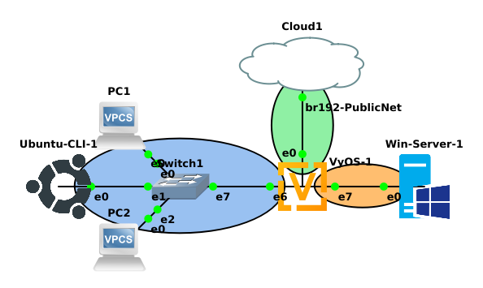

## ITS 2300 - Lab 10
### Introduction

-   Measure details of latency and bandwidth.

-   Experience with tools for network discovery and monitoring.

### Task 1 - Document and build the network.

1.  [Data] Complete the following IP grid, with the following policy.

-   HWRs production network uses the 10.48.0.0/16 address space.

-   All HWR networks use a /24 netmask

-   The 3rd Octet of the IP address is the network number

-   For example, LAN105's IP network would be 10.48.105.0/24.

|                   |**WAN**            |**LAN120**           |**LAN130**
|--                         |--                 |--                 |--
|Description                |To Internet        |To PC1             |To PC2
|Router Interface           |eth0               |eth6               |eth7
|Network Address            |132.235.160.128    |                   |
|CIDR Netmask               |/26                |/24                |/24
|Static client address      |From Blackboard    |--Not Applicable-- |--Not Applicable--
|DHCP Pool Start            |--Not Applicable-- |                   |
|DHCP Pool Stop             |--Not Applicable-- |                   |
|Gateway Address            |132.235.160.190    |                   |

2.  [Data] Draft VyOS command to configure the corresponding networks for Routing, NAT, DNS, and DHCP. Reference a lab notebook or previous labs.

3.  Create the following GNS3 project and configure the network per the IP grid.

### Task 2- Performance Testing Tools

The two key factors in network performance are latency and the bandwidth available on the network.

#### Task 2a - Ping

The measure of Latency is Round Trip Time (RTT). The Internet Control Messaging Protocol (ICMP) has a pair of packets, Echo Request and Echo Reply that can be used to measure the RTT between two computers. The ping utility that is available on nearly every computer is used to measure the network latency. Network Latency is also described as Lag in some applications.

Various operating systems implement the ping function differently. The critical difference is the default action. The following chart shows the default operation for Windows and Linux respectively and the flags needed for the corresponding action.

|                   |**Windows**            |**Unix (Including VyOS)**
|--                 |--                 |--
|5 Iterations       |`ping 8.8.8.8`     |`ping -c 5 8.8.8.8`
|Never ending       |`ping /t 8.8.8.8`  |`ping 8.8.8.8`

4.  [Data] Run the following set of pings and note the average latency between the source and the destination.

|Source             |Destination
|--                 |--
|Home Computer      |VyOS WAN address
|Home Computer      |www.ohio.edu
|Home Computer      |132.235.9.75
|Ubuntu GUI in GNS3 |www.ohio.edu
|Ubuntu GUI in GNS3 |132.235.9.75

#### Task 2b - iPerf

Bandwidth is more difficult to measure. iPerf3 is a tool to measure maximum bandwidth, delay, jitter, datagram loss.

5.  Install iperf3 on the Ubuntu-CLI client machine with the following command. Enter the itsclass user's password when prompted.

`sudo apt install -y iperf3`

6.  [Data] Use the following command to run the iperf3 program as a client and measure the bandwidth to Hurricane Electric's public iPerf server. This is a busy server, if the connection is refused, use the up arrow to recover the previous command and enter it again.

`iperf3 -i 1 -c iperf.he.net`

7.  [Data] In the previous command data was moving from the IPerf server to the client. Use the -r option to reverse the flow of traffic and measure the bandwidth from the client to the server.

`iperf3 -i 1 -r -c iperf.he.net`

#### Task 2c - Hybrid testing

Speedtest.net is a tool that is used to get an estimate of Internet performance, using a combination of latency and bandwidth testing.

8.  [Data] In a web browser on your home computer browse to: `https://www.speedtest.net` Select the big GO button to begin test and allow it to run an entire test. Record Ping, Download Speed and
Upload speed. Run test three times and record results for three successful runs. There is a "Results" button once the test finishes that will show the stats from multiple test runs.

9. Start a class video from blackboard or from some other video streaming service and repeat the speed test.

### Task 3 - Network Discovery

Nmap is a command line application used to scan local networks and machines. It can be installed on many different operating systems. Zenmap is graphical interface that uses nmap then neatly displays the
results. This application will scan a range of hosts (usually an entire subnet) and interrogate them to learn what services the hosts offer.

Watch the ECT Tech Nugget on NMAP at: [ECT Tech Nugget - N27.0 - Nmap](https://youtu.be/PBuoHk9fFgk)

10. On Windows Server Start Menu select the "Command Prompt" application.

11. In the black command window issue the command `choco install nmap` and leave the computer alone (no mouse and keyboard) until the installation is complete

12. Return to the start mene and select the "Nmap - Zenmap GUI" application.

13. Based on the lab demonstration scan the Lan-120 network
a.  Along the menu bar at the top there is a field labeled "Target:" input the network address and subnet mask.
b.  Under "Profile:" pull-down and select "Regular Scan".

14. [Data] Nmap will start scanning that range of hosts on the network. Look through the output tabs to display what information Nmap was able to find. Include the scan information in the final report.

### Lab Questions

1.  Based on the Ping data from Task 2, describe the relationship the various machines in the task to the topology of the Internet.

2.  Discuss the results of bandwidth testing from your home network. Note the changes that occurred, if any, when streaming traffic in parallel.

3.  Include a completed IP Grid, network diagram, and draft router commands.

4.  Include data from the marked [Data] steps.
